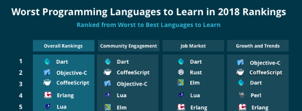
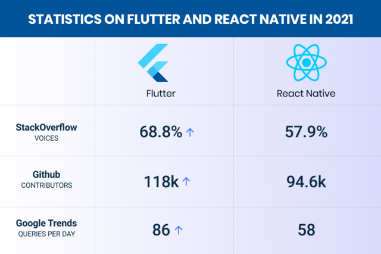

# Contents

### Preamble

   

- 다음 내용은 2018년 Codementor에서 선정한 최악의 프로그래밍 언어 순위입니다.

- 최악의 커뮤니티, 시장성, 트렌드와 성장 모두 타의 추종을 불허하던 Dart는 Google의 Flutter에 활용되면서 상황이 급변하기 시작했습니다.

- Google의 헌신적인 업데이트 덕분에 현재는 모바일 크로스 플랫폼 개발에서는 선두를 다투는 언어가 되었고 Google의 차세대 OS인 Fuchsia에 Flutter가 공식 Framework로 선정되면서 지금보다 앞으로가 더 기대되는 언어이기도 합니다.  

  

 
   

