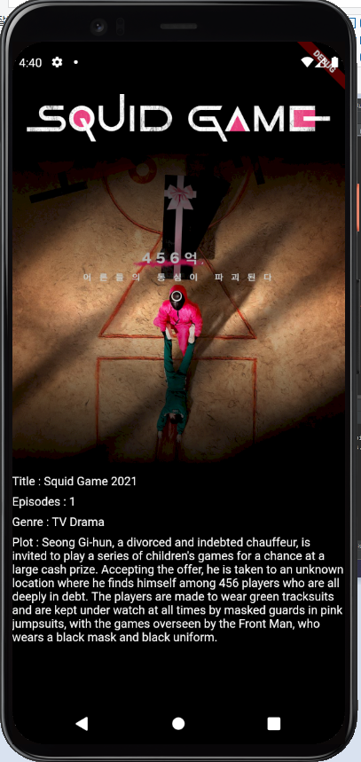

# Exercise 03 - Custom Widget

| 제출할 폴더 :   | ex03                       |
| :-------------- | :------------------------- |
| 제출할 파일 :   | main.dart, blur_image.dart |
| 허용되는 함수 : | 없음                       |
| 참고사항 :      | 없음                       |

- 이 과제의 목표는 본격적으로 Flutter Project를 시작하면서 특정한 기능을 가진 Widget을 구현해보고 변경하여 영화를 소개하는 페이지를 만들어 보는 것입니다.

- 프로젝트의 이름은 'my_widget'이여야 합니다.

- null safety와 lints 적용하지 않으려면 pubspec.yaml의 속성은 다음과 같이 수정하여야 합니다.

  ```yaml
  environment:
    sdk: ">=2.7.0 <3.0.0"
  
  dev_dependencies:
    flutter_test:
  	#flutter_lints: ^1.0.0
  ```

  - Correction

  ```dart
  //그리고 기본적으로 제공되는 코드의 일부분은 다음과 같이 변경되어야 합니다.
  MyApp({Key? key}); -> MyApp({Key key});
  MyHomePage({required this.title}) -> MyHomePage({@required this.title})
  ```
---
- 다음은 Flutter App이 AVD에서 어떻게 작동해야 하는지를 보여줍니다.
  
- 이미지는 다음과 같이 주어집니다.
  - https://w.namu.la/s/420422c9668360c3654fb8d4ba4b4921a22a8732d660e08d81cfa5281035aae6573a4f61927aaeecdcf6ee911af6ea5a4aa49bef54be3f63ada78ac5f914e1cfb4b78e644e2190944fb886f2688ffb91

  - https://maxmovie.cdnsave.com/images/1628644797279L0zPH.jpg

    
- Widget의 이름은 'BlurImage'이여야 합니다.
- 이미지는 반드시 URL을 통해 App에 표시되어야 합니다.
- 화면에 표시되는 이미지는 App의 중앙에 위치하고 이미지의 비율은 정확히 다음을 따라야 합니다. (width : 1.0, height : 1.0)
- Blur 처리는 이미지의 중앙으로부터 위 아래로 어둡게 `Fade Out`처리 되어야 합니다.
- BlurImage Widget은 이미지 주소 값을 **반드시** 전달해야 합니다.
- 이미지 하단에 존재하는 설명이 필수적인 것은 아닙니다.


⚡️Keyword

`AspectRatio`, `Stack`, `gradient`, `Expanded`

