# Rush

| 제출할 폴더 : | rush             |
| :------------ | :--------------- |
| 제출할 파일 : | 필요한 모든 파일 |
| 참고사항 :    | 없음             |

- Rush를 풀기 위해 앞선 과제들을 통과한 여러분은 이미 많은 것을 경험해볼 수 있었을 것이라 생각합니다.
- 이번 마지막 문제는 국내 유명한 소셜플랫폼 중 하나인 "당근마켓"을 클론코딩하여, 42마켓을 만드는  것입니다.
- 42마켓의 이름, 색상 등은 고려하지 않습니다.
- 이번 과제에서 디자인 부분은 다르게 작성하여도 됩니다. 하지만 그만한 이유가 있어야 합니다.
- 이번 과제는 당근마켓 depth 1까지 클론코딩하는 것입니다. 아래와 같은 페이지를 전부 구현해야 합니다.
- 스플래시 화면은 구현하지 않습니다.

 ```bash
  .
  +-- 홈
  |  +-- 동네홍보
  |  +-- 중고거래
  |  +-- $(게시글열람)
  +-- 동네생활
  |  +-- $(게시글열람)
  |  +-- 동네생활 글쓰기
  +-- 내 근처
  |  +-- $(게시글열람)
  |  +-- 과외.클래스
  |  +-- 농수산물
  |  +-- 생활서비스
  +-- 채팅
  |  +-- 1:1 채팅화면
  +-- 나의 당근
  |  +-- 프로필화면
  |  +-- 관심목록
  |  +-- 내 동네 설정
  |  +-- 관심 카테고리 설정
 ```
## 요구사항

### 전체

- 앞서 배운 모든 지식을 사용해야 합니다. 사용되지 않는 위젯은 넣지 않아도 됩니다.
- 데이터는 firebase에 저장되어야 합니다. 어플이 껐다켜져도 최신 데이터를 유지해야 합니다.
- 따로 요구하지 않는 한, 모든 화면전환은 `fade in`, `fade out` 입니다.
- 열람이 가능한 게시글은 볼 수 있어야 하고, `찜 기능`이 가능해야 합니다.
- 구현하지 않아도 되는 서비스(아이템)라도 화면은 똑같이 구현해야 합니다. 즉, depth0의 모든 내용은 똑같이 클론코딩되어야 합니다.
- 구현하지 않아도 되는 서비스는 `스낵바를 이용하여 들어갈 수 없음을 명시`해야 합니다.
- depth1의 화면에서는 뒤로가기 이외의 화면전환이 필요하지 않습니다. 단, 사용자와 위젯 간 상호작용은 이루어져야 합니다.
- 구현하지 않아도 되는 부분을 구현할 경우 제대로 동작하여야 합니다.
- 글씨크기, 레이아웃 등의 디자인 요소는 검사하지 않습니다.
    - 상호작용하지 않아도 된다 ⇒ UI는 구현하되, 어떠한 동작이 일어나진 않음
    - 구현하지 않아도 된다 ⇒ UI가 다르거나 없어도 평가에 영향을 미치지 않음
- 게시글 리스트에 게시글이 없을 경우 적절한 조치를 취해야 합니다.

---

### 홈

- 빨간 사각형 내부의 위젯들은 사용자와 상호작용하지 않아도 됩니다.  

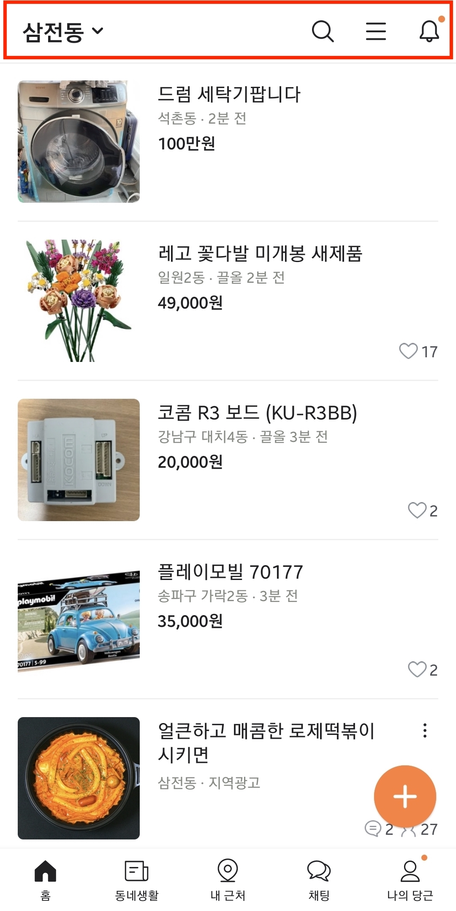  

- 아래와 같은 방법으로 `동네홍보`와 `중고거래`로 화면전환 할 수 있어야 합니다.
- 화면의 opacity는 구현하지 않아도 됩니다.  

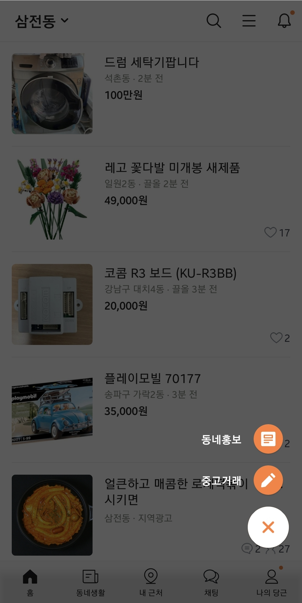  

---

### 홈-디테일

- 채팅으로 거래하기 버튼은 채팅 페이지와 연동되어야 합니다.
- 빨간 사각형의 위젯들은 사용자와 상호작용하지 않아도 됩니다.
- 매너온도, 디지털 기기 등의 화면전환을 위한 링크는 구현하지 않아도 됩니다.
- 찜하기 기능은 작동되어야 하며, 관심목록에 게시글이 보여야 합니다.
- 찜하기의 상태는 어플이 껐다 켜져도 상태를 유지해야 합니다.  

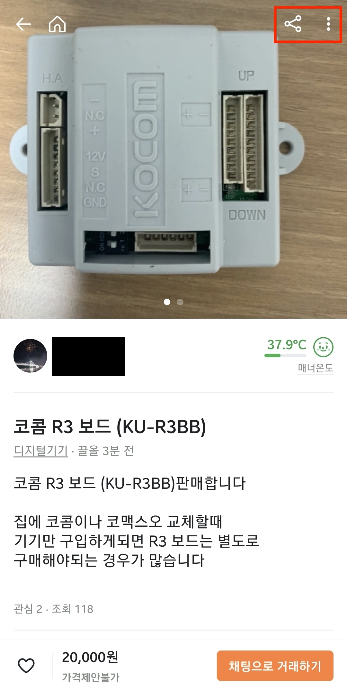  

> ❗️게시글열람화면(detail_post)은 일반 appbar와 다르게 스크롤에 의한 투명도 조정 등이 일어납니다. 해당 부분은 고려하지 않고 일반 appbar로 만들어도 되며, 실제 어플과 같이 만들고 싶은 경우 유튜브 <개발하는 남자>의 당근마켓 클론토딩 7~10번을 참고해주세요.

- `이 게시글 신고하기` 아래부터는 구현하지 않아도 됩니다.  

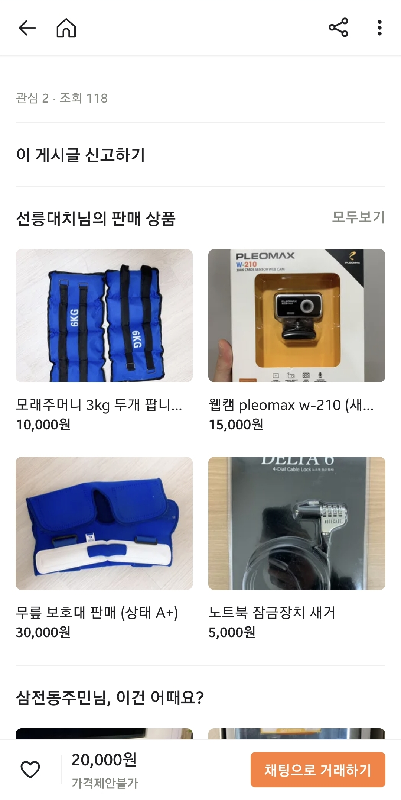  

---

### 동네생활

- 당겨서 새로고침은 구현하여도 되고 하지 않아도 됩니다. 단, 구현하지 않을 경우 새로고침을 할 수 있는 버튼을 동네생활 화면 내부에 배치해야 합니다.
- 파란 박스의 부분은 사용자와 상호작용하지 않아도 됩니다.
- 빨간 박스의 UI는 구현하지 않아도 됩니다. 구현한다면 기능이 제대로 동작하여야 합니다.
- 초록 박스의 내용은 카테고리와 상관없이 같게 구현하면 됩니다. (공감하기, 댓글쓰기로 통일)  

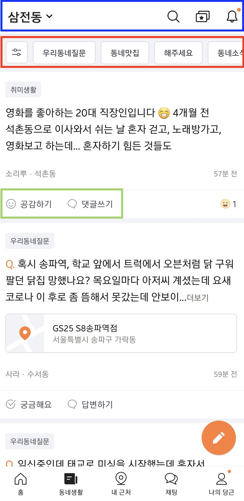  

---

### 동네생활-디테일

- 당겨서 새로고침은 구현하여도 되고 하지 않아도 됩니다. 단, 구현하지 않을 경우 새로고침을 할 수 있는 버튼을 동네생활 화면 내부에 배치해야 합니다.
- 빨간 박스의 위젯은 다음과 같은 상호작용만 구현하면 됩니다. 더 구현할 경우 작동이 제대로 되어야 합니다.
  - 공감하기 기능은 빨간 박스 우측 카운팅만 되면 됩니다.
  - 공감하기 기능은 `좋아요` 하나입니다.
  - 댓글쓰기는 상호작용하지 않아도 됩니다.
- 초록박스의 위젯들은 사용자와 상호작용하지 않아도 됩니다.
- 파란박스의 위젯들은 사용자와 상호작용하지 않아도 됩니다.
- 댓글은 정상적으로 작성되고 표출되어야 합니다.  

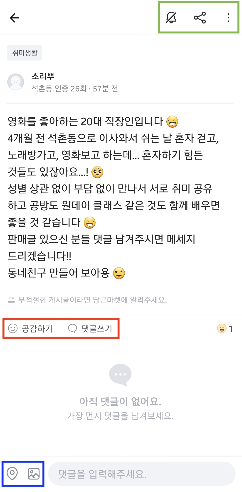  

---

### 동네생활-글쓰기

- 빨간 박스의 위젯들은 상호작용하지 않아도 됩니다.
- 글쓰기는 정상적으로 이루어져야 하고, 작성 완료 후 동네생활 탭에서 볼 수 있어야 합니다.  

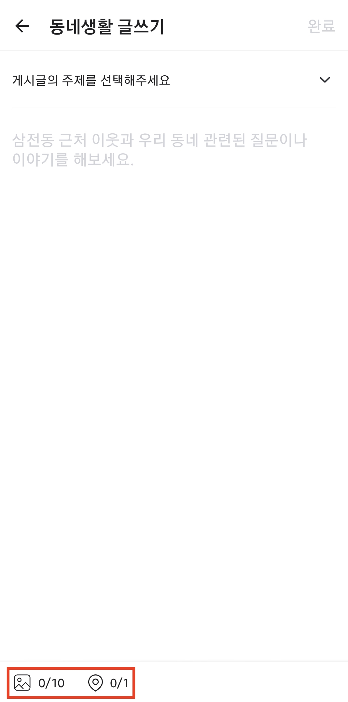  

---

### 동네생활-글쓰기-주제선택

- 주제는 우리동네 질문, 동네사건사고, 취미생활 3개만 선택할 수 있습니다.
- 나머지 주제는 스낵바 등을 활용하여 선택할 수 없음을 사용자에게 적절히 알려야 합니다.  

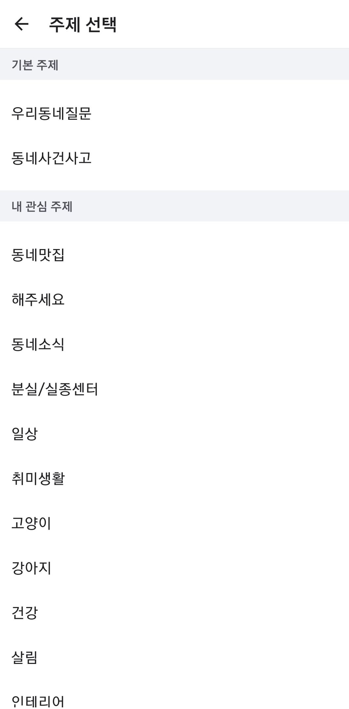  

---

### 내 근처1

- 당겨서 새로고침은 구현하여도 되고 하지 않아도 됩니다. 단, 구현하지 않을 경우 새로고침을 할 수 있는 버튼을 동네생활 화면 내부에 배치해야 합니다.
- 빨간 박스의 위젯은 상호작용하지 않아도 됩니다.
- 파란 박스의 위젯은 상호작용하지 않아도 됩니다. 단 스크롤은 가능해야 합니다.
- 초록 박스의 위젯은 상호작용하지 않아도 됩니다.
- 쿠폰북 ~ 국민지원금 카테고리 중 농수산물, 생활서비스, 동네장보기 버튼 이외의 위젯은 상호작용하지 않아도 됩니다.  

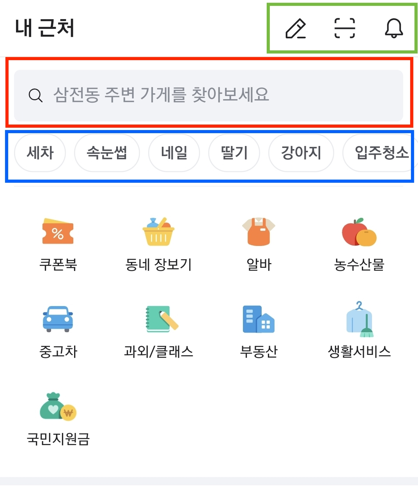  

### 내 근처2

- 게시글은 들어가서 볼 수 없어도 됩니다. 단 구현할 경우 당근마켓과 같아야 합니다.
- 빨간 박스의 키워드는 TabBar입니다.
- 빨간 박스의 카테고리는 3개 이상 구현하여야 합니다.
- 초록 박스는 구현하지 않아도 됩니다.  

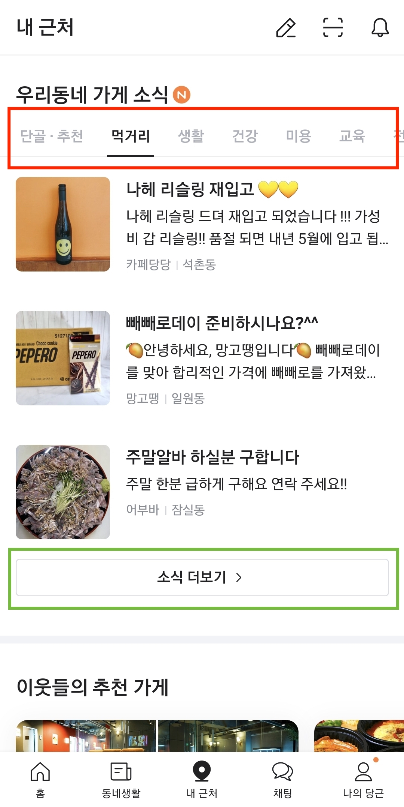  

---

### 내 근처3

- Divider는 눈에 띄어야 합니다.

- `이웃들의 추천 가게` 이하 위젯들은 전부 상호작용하지 않아도 됩니다.

단, 스크롤은 정상적으로 작동해야 합니다.  

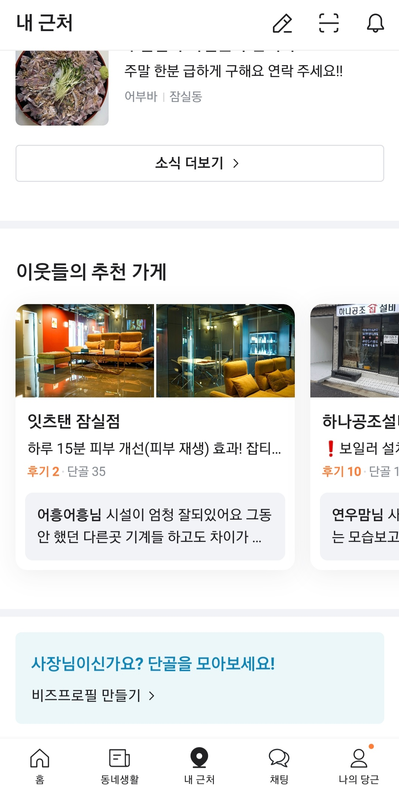  

---

### 내 근처 - 농수산

- 빨간 박스는 상호작용하지 않아도 됩니다.
- 게시글을 터치했을 때 Detail_Post로 넘어가지 않아도 됩니다.(상호작용하지 않아도 됩니다) 단, 스크롤은 정상작동되어야 합니다.  

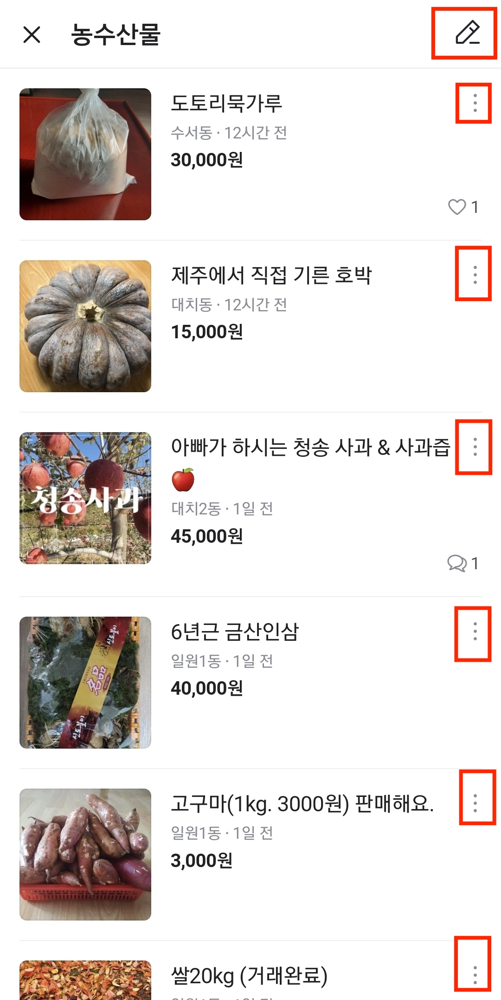  

---

### 내 근처 - 생활서비스

- 리스트는 최소 10개 이상의 업체 정보를 보여주어야 합니다.  

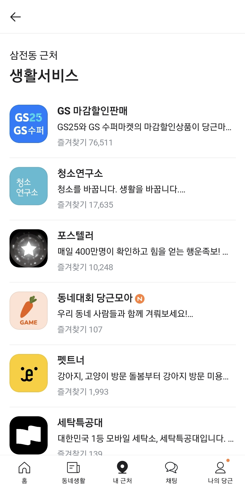  

---

### 내 근처 - 장보기

- 빨간 박스는 상호작용할 필요가 없습니다. 다만, 스크롤은 정상작동되어야 합니다.
- 파란박스는 구현하지 않아도 됩니다.
- 동네가게 상품 터치 시 Detail_Post로 가지 않아도 됩니다.  

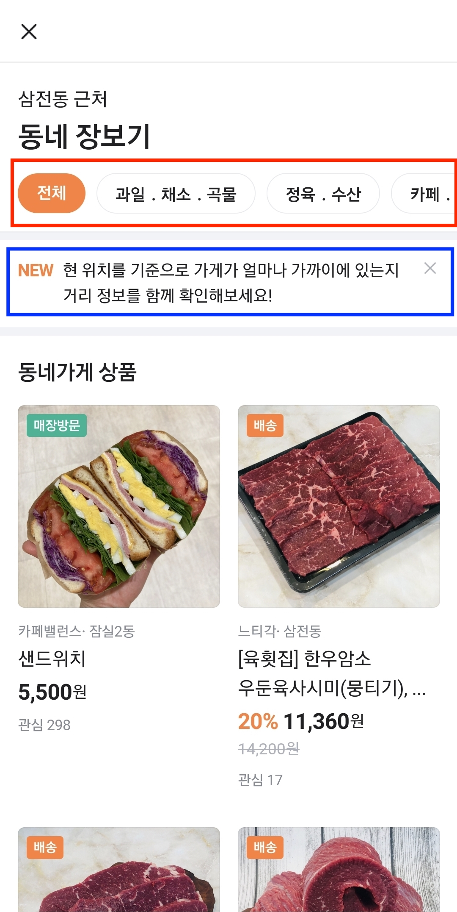  

---

### 채팅

- 모자이크된 부분때문에 구현히 힘드신 분은 직접 확인하시면 됩니다.
- 채팅 속 `당근이는` 구현하지 않아도 됩니다. 구현한다면 당근마켓과 같아야 합니다.
- 채팅은 해당 판매게시글(홈-디테일)과 연동이 되어야 합니다. 자세한 사항은 당근마켓 어플을 참고바랍니다.
- 빨간박스의 위젯은 상호작용하지 않아도 됩니다.
- 파란박스의 위젯은 구현하지 않아도 됩니다.  

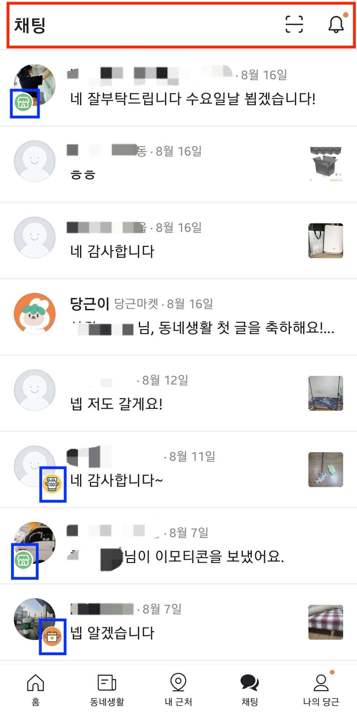  

---

### 채팅-디테일

- 빨간박스의 위젯은 상호작용하지 않아도 됩니다.
- 파란박스의 부분을 클릭하면, 해당하는 판매페이지(홈-디테일)로 이동이 가능해야 합니다.
- 초록박스는 구현하지 않아도 됩니다.
- 보라박스는 구현하지 않아도 됩니다.
- 채팅은 정상적으로 작동이 되야 하며, 어플이 꺼졌다 켜지더라도 내용이 유지되야 합니다.
- 채팅의 시간 부분은 꼭 12시간을 지킬 필요는 없습니다.  

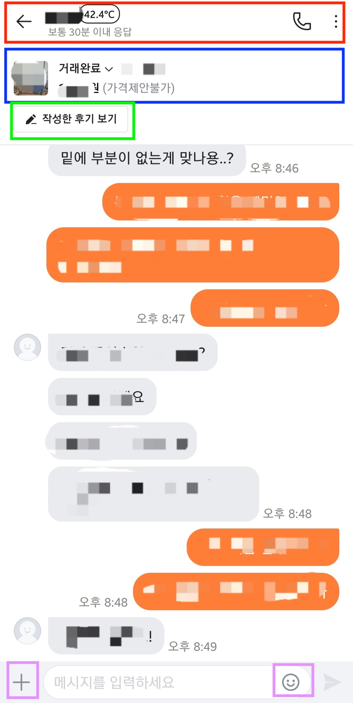  

---

### 나의 당근

- 빨간박스의 위젯은 상호작용하지 않아도 됩니다.
- 프로필, 관심목록, 내 동네 설정, 관심 카테고리 설정을 제외한 나머지 위젯은 스낵바 등을 이용하여 들어갈 수 없음을 적절히 표시해야 합니다.  

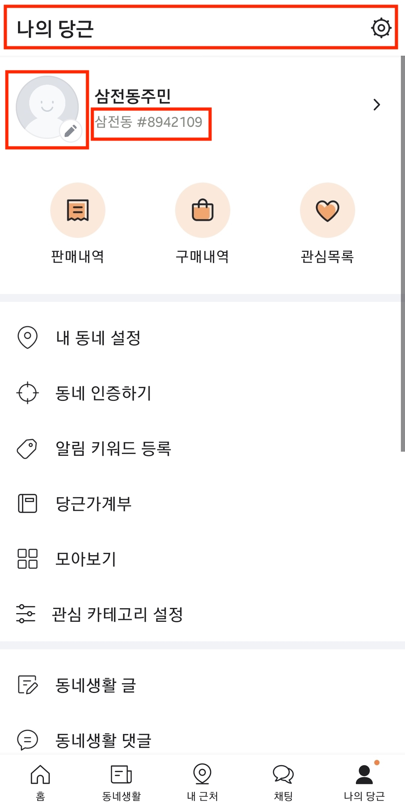

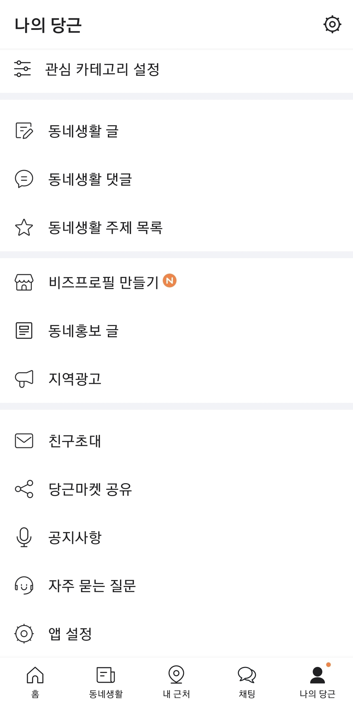  

---

### 나의 당근 - 프로필

- 화면의 모든 위젯은 상호작용하지 않아도 됩니다. 단, 구현할 경우 당근마켓과 같아야 합니다.
- 레이아웃은 당근마켓과 거의 유사하여야 합니다.  

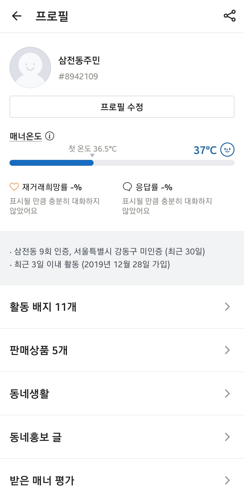  

---

### 나의 당근 - 관심목록

- 찜하기는 실제 게시글과 연동이 되어야 합니다.
- 빨간박스의 위젯은 탭바입니다.
- 파란박스를 누르면 해당 게시물로 이동이 가능해야 합니다. 그 이외의 상호작용은 하지 않습니다.   

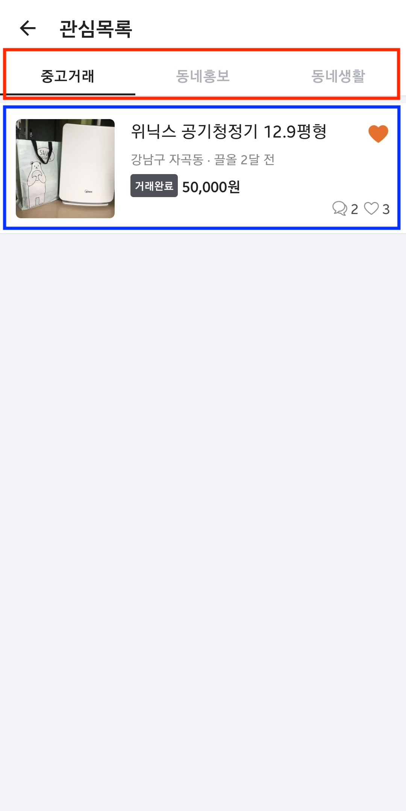

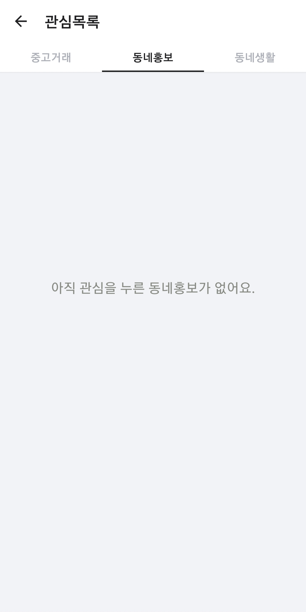  

---

### 나의 당근 - 내 동네 설정

- 빨간박스 내 위젯은 상호작용할 필요는 없습니다. 단, 구현한다면 당근마켓과 같아야 합니다.
- 빨간박스의 동 이름은 검사하지 않습니다.
- 파란박스 내 위젯 중 지도와 관련된 위젯은 정확하게 구현하지 않아도 됩니다. 단, 당근마켓처럼 슬라이딩 바에 대한 상호작용이 있어야 합니다. (즉, 사각형으로만 구현해도 무방합니다.)
- 해당 화면의 위젯 상호작용으로 인해 게시글의 정보가 바뀌진 않습니다.  

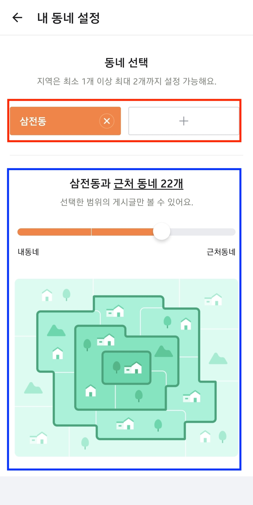  

---

### 나의 당근 - 관심 카테고리 설정

- 해당 화면의 상호작용으로 인해 게시글의 정보가 바뀌진 않습니다.  

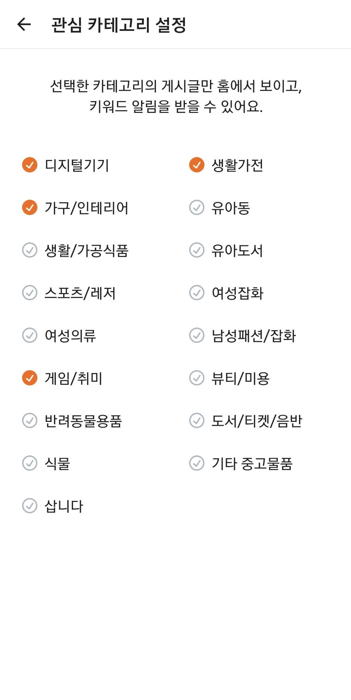  
