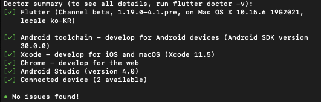

# Exercise 00 - First Step

| 제출할 폴더 :   | ex00 |
| :-------------- | :--- |
| 제출할 파일 :   | 없음 |
| 허용되는 함수 : | 없음 |
| 참고사항 :      | 없음 |

- 이 과제의 목표는 모바일 앱을 만들기 위한 첫 시작으로서 환경을 설정하면서 발생하는 다양한 문제를 겪어보고 해결 해 나가는 것입니다.

- 다음은 Flutter doctor가 어떻게 작동해야 하는지 보여줍니다.

  

- 빠르고 간편한 Flutter App을 만들기 위해서 Device가 반드시 필요한 것은 아닙니다.

⚡️Keyword

`Android Studio`, `Flutter SDK`, `Flutter Doctor`

