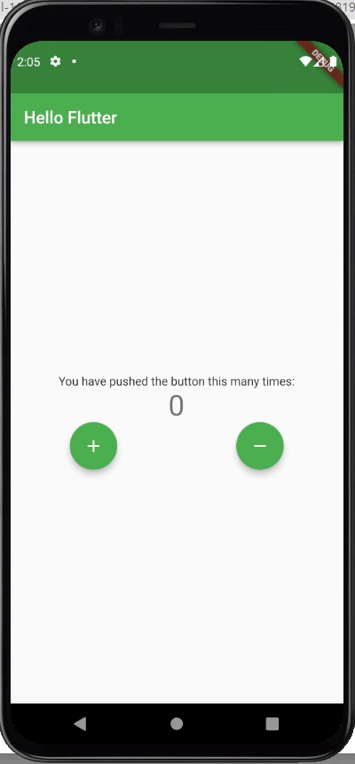

# Exercise 01 - Hello Flutter

| 제출할 폴더 : | ex01      |
| :------------ | :-------- |
| 제출할 파일 : | main.dart |
| 참고사항 :    | 없음      |

- 이 과제의 목표는 Flutter Project를 시작하면서 자동으로 Build되는 코드를 변경하여 UI를 바꾸고 `Hot Reload`의 놀라운 기능을 경험해 보는 것입니다.

- 프로젝트의 이름은 `hello_flutter`여야 합니다.

- null safety와 lints 적용하지 않으려면 pubspec.yaml의 속성은 다음과 같이 수정을 해야 합니다.

  ```yaml
  environment:
    sdk: ">=2.7.0 <3.0.0"
  
  dev_dependencies:
    flutter_test:
  	#flutter_lints: ^1.0.0
  ```

- Correction

  ```dart
  //그리고 기본적으로 제공되는 코드의 일부분은 다음과 같이 변경되어야 합니다.
  MyApp({Key? key}); -> MyApp({Key key});
  MyHomePage({required this.title}) -> MyHomePage({@required this.title})
  ```

---

- 다음은 Flutter App이 AVD(혹은 Simulator)에서 어떻게 작동해야 하는지를 보여줍니다.

  


  - 버튼을 눌렀을 때 값이 증가해야 합니다.
      - 값이 증가할 때 호출하는 메서드의 이름은 `_increaseCount`여야 합니다.
  - 버튼을 눌렀을 때 값이 감소해야 합니다.
      - 값이 감소할 때 호출하는 메서드의 이름은 `_decreaseCount`여야 합니다.
  - App의 전체적인 분위기는 반드시 같아야 합니다.


⚡️Keyword

`AppBar`, `FloatingButton`, `Colors`, `setState`, `Column`, `Row`
