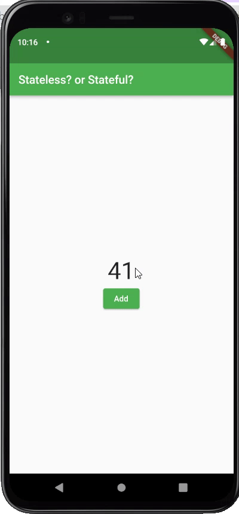

# Exercise 02 - Stateless? or Stateful?

| 제출할 폴더 : | ex02      |
| :------------ | :-------- |
| 제출할 파일 : | main.dart |
| 참고사항 :    | 없음      |

- 이 과제의 목표는 Flutter에서 Widget의 상태라는 개념을 이해하고 Widget의 생명주기를 이해하는 것입니다.

- 프로젝트의 이름은 `widget_lifecycle`이어야 합니다.

- null safety와 lints 적용하지 않으려면 pubspec.yaml의 속성은 다음과 같이 수정을 해야 합니다.

  ```yaml
  environment:
    sdk: ">=2.7.0 <3.0.0"
  
  dev_dependencies:
    flutter_test:
  	#flutter_lints: ^1.0.0
  ```

  - Correction

  ```dart
  //그리고 기본적으로 제공되는 코드의 일부분은 다음과 같이 변경되어야 합니다.
  MyApp({Key? key}); -> MyApp({Key key});
  MyHomePage({required this.title}) -> MyHomePage({@required this.title})
  ```

---

- 주어진 코드로 아래의 App을 만들어야 합니다.
- 다음은 Flutter App이 AVD(혹은 Simulator)에서 어떻게 작동해야 하는지를 보여줍니다.

  

- 초기 App화면은 count값이 41이어야 합니다.

  - Warning
    - int count = 0; 부분을 수정하지 마세요!
    - count의 값을 변경하는 부분은 반드시 Override된 메서드에서 처리해야 합니다.
    - 무슨 말인지 모르시겠다구요? 걱정마세요 동료 평가로 인해 이해하게 될 것입니다.

- Add 버튼을 눌렀을 때 값이 1 증가해야 합니다.

- 값이 42일때 App 하단에 일시적 메시지를 띄워야 합니다.

- Scaffold가 AppBar를 호출하는 메서드의 이름은 아래와 같아야 합니다.

```
_buildAppBar
```

  - _buildAppBar 메서드는 PreferredSizeWidget을 반환해야 합니다.

- Scaffold가 body를 호출하는 메서드의 이름은 아래와 같아야 합니다.

```
_buildBody
```

  - _buildBody 메서드는 Widget을 반환해야 합니다.

- App의 전체적인 분위기는 반드시 같아야 합니다.


⚡️Keyword

`stateless`, `stateful`, `lifecycle`, `snackbar`, `BuildContext`, `initState`, `createState`

