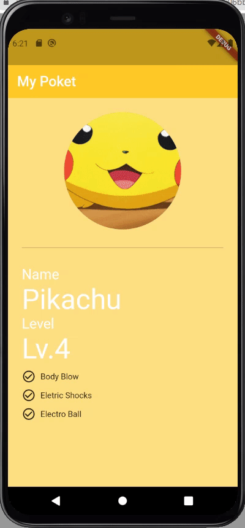
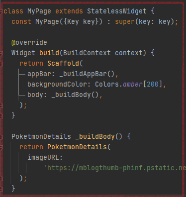

# Exercise 04 - Pocketmonster

| 제출할 폴더 :   | ex04                                                         |
| :-------------- | :----------------------------------------------------------- |
| 제출할 파일 :   | main.dart, poketmon_details.dart                             |
| 허용되는 함수 : | 없음                                                         |
| 참고사항 :      | `pockemon_details.dart` 파일의 위치는 `/ex04/custom_widget` 입니다. |

- 이 과제의 목표는 본격적으로 전체적인 하나의 화면의 구성을 생각하고 구현해보고 완성된 화면을 보며 **귀여움**을느껴 보는 것입니다.

- 프로젝트의 이름은 `poketmonster`여야 합니다.

- null safety와 lints 적용하지 않으려면 pubspec.yaml의 속성은 다음과 같이 수정을 해야 합니다.

  ```yaml
  environment:
    sdk: ">=2.7.0 <3.0.0"
  
  dev_dependencies:
    flutter_test:
  	#flutter_lints: ^1.0.0
  ```

- Correction

  ```dart
  //그리고 기본적으로 제공되는 코드의 일부분은 다음과 같이 변경되어야 합니다.
  MyApp({Key? key}); -> MyApp({Key key});
  MyHomePage({required this.title}) -> MyHomePage({@required this.title})
  ```

---

- 다음은 Flutter App이 AVD에서 어떻게 작동해야 하는지를 보여줍니다.  
  


  - 이미지는 다음과 같이 주어집니다.

    - https://mblogthumb-phinf.pstatic.net/MjAxNzAyMjVfMjMg/MDAxNDg3OTUzMTI3Mzc0._tG2RA_tY9IZcrw10kWz3YfLkhcuSRxm_rUQoLRhsQEg.hndrmcX4b8HI5c_EJB_JfftjG6C79zJXLQ0g6dZy9FQg.GIF.doghter4our/IMG_3900.GIF?type=w800

  - 이미지는 반드시 URL을 통해 App에 표시되어야 합니다.

  - Scaffold가 AppBar를 호출하는 메서드의 이름은 `_buildAppBar`여야 합니다.

  - Scaffold가 body를 호출하는 메서드의 이름은 `_buildBody`여야 합니다.

  - 각 Widget들은 보기에 적당한 거리를 두어야 합니다.

  - 화면에 움직임이 있는 것 같다구요? 하지만 그것은 움직임일 뿐 상태를 가진것은 아니에요!

  - Custom Widget으로 구성한 뒤 필요한 이미지 주소를 **`반드시`**전달받고 다음과 같이 호출되어야 합니다.

    - Hint
      


  - 각 Widget의 정확한 간격이 궁금한가요? 귀여운 App에 1px의 단호함은 필요하지 않습니다. 8px의 배수로 적절하게 맞추세요.


⚡️Keyword

`Divider`, `CircleAvatar`, `Padding`

