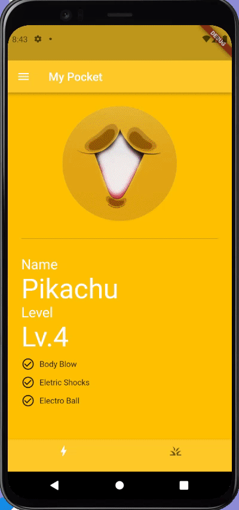

# Exercise 05 - Pocketmon Trainer

| 제출할 폴더 :   | ex05                                                         |
| :-------------- | :----------------------------------------------------------- |
| 제출할 파일 :   | main.dart, poketmon_details.dart                             |
| 허용되는 함수 : | 없음                                                         |
| 참고사항 :      | `pockemon_details.dart` 파일의 위치는 `/ex05/custom_widget` 입니다. |

- 이 과제의 목표는 본격적으로 전체적인 하나의 화면의 구성을 생각하고 구현해보고 완성된 화면을 보며 **귀여움**을느껴 보는 것입니다.

- 프로젝트의 이름은 'poketmonster'이여야 합니다.

- null safety와 lints 적용하지 않으려면 pubspec.yaml의 속성은 다음과 같이 수정하여야 합니다.

  ```yaml
  environment:
    sdk: ">=2.7.0 <3.0.0"
  
  dev_dependencies:
    flutter_test:
  	#flutter_lints: ^1.0.0
  ```

- Correction

  ```dart
  //그리고 기본적으로 제공되는 코드의 일부분은 다음과 같이 변경되어야 합니다.
  MyApp({Key? key}); -> MyApp({Key key});
  MyHomePage({required this.title}) -> MyHomePage({@required this.title})
  ```

---

- 다음은 Flutter App이 AVD(혹은 Simulator)에서 어떻게 작동해야 하는지를 보여줍니다.  
  


  - 이미지는 다음과 같이 주어집니다.

    - https://mblogthumb-phinf.pstatic.net/MjAxNzAyMjVfMjMg/MDAxNDg3OTUzMTI3Mzc0._tG2RA_tY9IZcrw10kWz3YfLkhcuSRxm_rUQoLRhsQEg.hndrmcX4b8HI5c_EJB_JfftjG6C79zJXLQ0g6dZy9FQg.GIF.doghter4our/IMG_3900.GIF?type=w800
    - http://file3.instiz.net/data/file3/2018/08/14/d/7/b/d7b25d5d584d77103901068ed3844b9d.gif
    - https://esquilo.io/png/thumb/hiZKt04D3Noh5n9-Ash-Ketchum-PNG-Image.png

- 이전 과제에서 만든 Custom Widget에 여러분들의 상상력이 갇힐 필요는 없습니다. 개선을 통해 더 확장성 있는 구조가 가능하다면 바꾸세요.

- 이미지는 반드시 URL을 통해 App에 표시되어야 합니다.

- Scaffold가 AppBar를 호출하는 메서드의 이름은 `_buildAppBar`여야 합니다.

- Scaffold가 body를 호출하는 메서드의 이름은 `_buildBody`여야 합니다.

- Scaffold가 bottomNavigationBar를 호출하는 메서드의 이름은 `_buildBottomNavigationBar`여야 합니다.

- AppBar와 BottomNavigationBar는 같은 색상 값을 사용해야 합니다.

- Material Design을 준수한 Icon들은 https://material.io/icons에서 찾을 수 있습니다.

- 화면의 구성에 필요한 값은 List, Map으로 적절하게 관리되어야 합니다.

- 포켓몬의 능력에 맞추어 사용가능한만큼 스킬을 표시해야 합니다.

- 트레이너 페이지는 필수가 아니지만 만들 수 있다면 다양한 경험을 해 볼 수 있을 것입니다.


⚡️Keyword  
`Refector`, `Padding`, `Drawer`, `ListTile`, `Material Design`, `spread operator`
