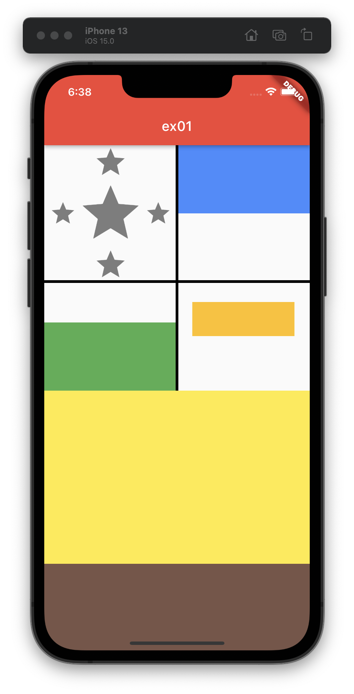

# Exercise 01 - What is Layout?

| 제출할 폴더 : | ex01      |
| :------------ | :-------- |
| 제출할 파일 : | main.dart |
| 참고사항 :    | 없음      |

- 이 과제의 목표는 각종 레이아웃을 살펴보고 어떤 차이점이 있는지 알아보는 것입니다.

- 프로젝트의 이름은 `hello_layout`이어야 합니다.

- null safety와 lints 적용하지 않으려면 pubspec.yaml의 속성은 다음과 같이 수정을 해야 합니다.

  ```yaml
  environment:
    sdk: ">=2.7.0 <3.0.0"
  
  dev_dependencies:
    flutter_test:
  	#flutter_lints: ^1.0.0
  ```

- Correction

  ```dart
  //그리고 기본적으로 제공되는 코드의 일부분은 다음과 같이 변경되어야 합니다.
  MyApp({Key? key}); -> MyApp({Key key});
  MyHomePage({required this.title}) -> MyHomePage({@required this.title})
  ```

---



- 이 서브젝트와 색이 일치하지 않아도 됩니다. ( 하지만 영역이 확실히 구분 되어야 합니다. )
- 테이블 안쪽 줄은 각 영역을 확실히 구분해야 합니다.
- 테이블의 높이는 정확하지 않아도 되고 하드코딩을 해도 되지만, 보기와 비슷한 크기여야 합니다.
- 테이블의 1번 그림의 별은 Icon만을 사용하여 만들어야 합니다.
- 테이블의 1번 그림은, Row와 Column 사용을 엄격히 금지합니다.
- 테이블의 2~4번은 빈 공간의 높이가 색칠된 공간의 높이와 같지 않아도 되나, 하얀 빈 공간의 위치는 일치해야 합니다.
- 테이블 2 ~ 3번 중 Container는, width와 height 속성을 둘 다 가질 수 없습니다.(하나만 사용해야 합니다)
- 테이블 4번은 Tablecell, Row, Container만을 사용하여야 합니다.
- 테이블 4번의 Container는 width와 height 속성 두개를 다가지고 있어야 하며, 2 ~ 3번과 같이 하나만 사용할 수 없는 이유를 설명할 수 있어야 합니다.
- 아래 두 섹션(노란색과 갈색)은 테이블이 아닙니다.
- 아래 두 섹션(노란색과 갈색)은 높이가 논리적으로 정확히 2 : 1 비율이며, 화면에 빈공간이 있으면 안됩니다.
- Mediaquery, Stack, SizedBox의 사용을 금지합니다.

⚡️Keyword
`Table`, `Expanded`, `Container`, `Icon`, `Flex`, `flex`, `EdgeInset`