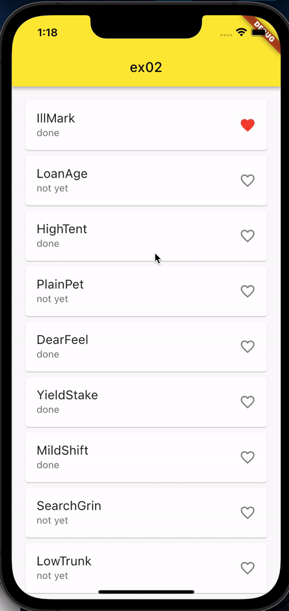
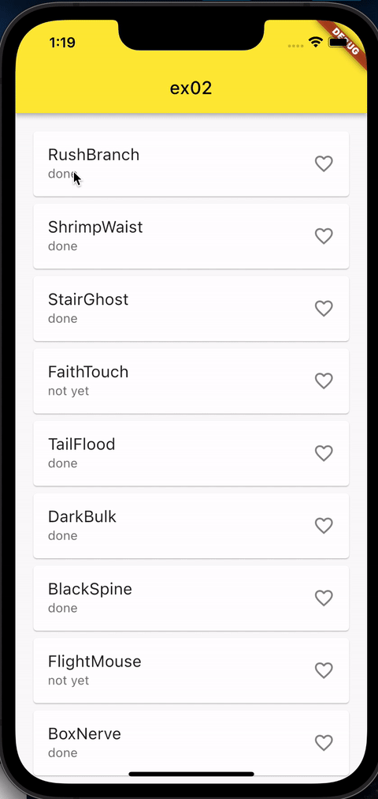

# Exercise 03 - Infinity Loop++

| 제출할 폴더 : | ex03                                                   |
| :------------ | :----------------------------------------------------- |
| 제출할 파일 : | `ex03/main.dart`, `ex03/custom_widget/blur_image.dart` |
| 참고사항 :    | 없음                                                   |

- 이 과제의 목표는 본격적으로 Flutter Project를 시작하면서 특정한 기능을 가진 Widget을 구현해보고 변경하여 나만의 Widget을 만들어 보는 것입니다.

- 프로젝트의 이름은 `my_widget`이어야 합니다.

- null safety와 lints 적용하지 않으려면 pubspec.yaml의 속성은 다음과 같이 수정을 해야 합니다.

  ```yaml
  environment:
    sdk: ">=2.7.0 <3.0.0"
  
  dev_dependencies:
    flutter_test:
  	#flutter_lints: ^1.0.0
  ```

- Correction

  ```dart
  //그리고 기본적으로 제공되는 코드의 일부분은 다음과 같이 변경되어야 합니다.
  MyApp({Key? key}); -> MyApp({Key key});
  MyHomePage({required this.title}) -> MyHomePage({@required this.title})
  ```

---

- 다음은 Flutter App이 AVD(혹은 Simulator)에서 어떻게 작동해야 하는지를 보여줍니다.

  >❗️ex02문제를 복사해서 가져오십시오.

  

- 각 카드를 누르면 하트가 빨간색으로 바뀌어야 하고, 껐다 켤 수 있어야 합니다.
- 하트의 껏다켜짐은 어플이 꺼지지 않는 이상 유지되어야 합니다.
- 길게 눌렀을 때에는 아무 동작도 하지 말아야 합니다.

  

- 왼쪽 혹은 오른쪽으로 카드를 슬라이드하여 삭제할 수 있습니다.
- 왼쪽에는 remove가 왼쪽, 오른쪽은 remove가 오른쪽에 있어야 한다.
- 실제로 데이터가 삭제되어야 합니다. UI의 내용과 실제 데이터에 차이가 있으면 에러가 발생합니다.
- 데이터의 중복은 상관하지 않습니다.
- 데이터가 삭제되어도 무한 스크롤은 유지되어야 합니다.
- 좋아요, subtext등의 요소는 삭제행위로 인해 변경되지 않아야 합니다.

⚡️Keyword
`ListView.Builder`, `Dismissible`, `Card`

