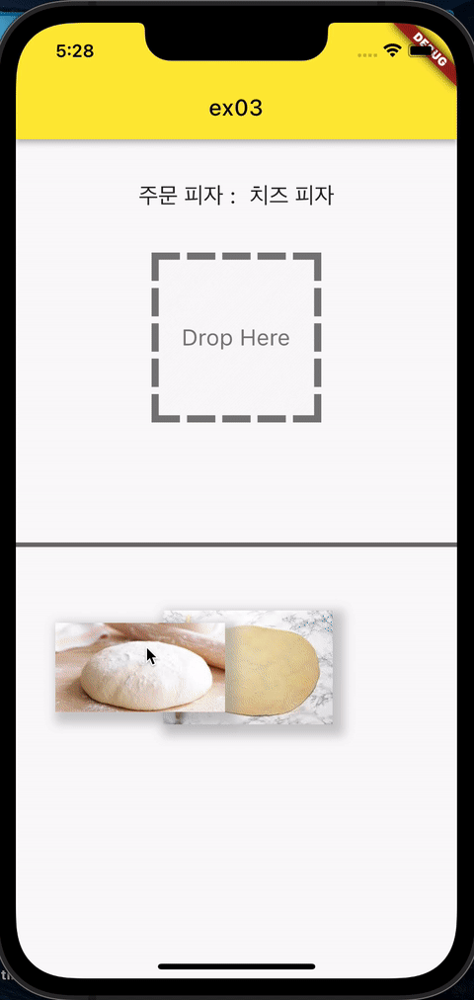
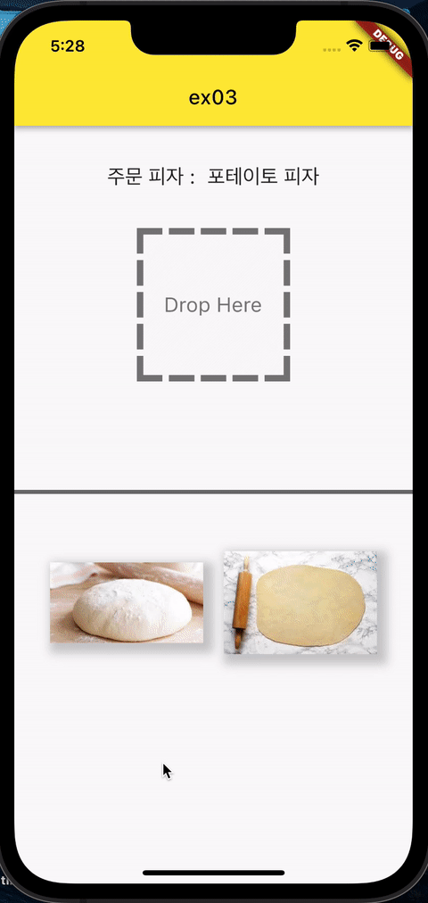

# Exercise 04 - Master Chef Korea

| 제출할 폴더 : | ex04      |
| :------------ | :-------- |
| 제출할 파일 : | main.dart |
| 참고사항 :    | 없음      |

- 이 문제는 피자을 만들어보는 문제입니다. 근데 이제 플러터를 곁들인.

- 이번 프로젝트는 조금 친절합니다.

- 프로젝트의 이름은 `my_pizza`여야 합니다.

- null safety와 lints 적용하지 않으려면 pubspec.yaml의 속성은 다음과 같이 수정을 해야 합니다.

  ```yaml
  environment:
    sdk: ">=2.7.0 <3.0.0"
  
  dev_dependencies:
    flutter_test:
  	#flutter_lints: ^1.0.0
  ```

- Correction

  ```dart
  //그리고 기본적으로 제공되는 코드의 일부분은 다음과 같이 변경되어야 합니다.
  MyApp({Key? key}); -> MyApp({Key key});
  MyHomePage({required this.title}) -> MyHomePage({@required this.title})
  ```

---

- seunpark은 학교 과제를 위해 피자만들기 어플을 하나 만들었습니다. 시간에 쫓겨 대충 만들다보니 제대로 작동을 하지 않습니다. 함수명은 대충 알아볼 정도만 적혀있고, 함수가 중구난방 나누어져 보기도 정말 힘듭니다.  여러분들은 seunpark을 위해 SnackBar와 Dialog 등 위젯이 제대로 작동하게 만들어야 합니다. 평가자가 만족할만한 refactoring을 해내신다면, 추가점수가 지급됩니다.
- 제공된 main.dart를 수정하세요
- 위젯들을 메소드로 나누어 문제를 풀면 더 쉬워집니다.

---
- Draggable / DragTarget
  - Draggable위젯을 움직일 때, 원래 있던 자리에 사진이 남아있어선 안됩니다.
- SnackBar
  - Draggable위젯과 DragTarget의 원리를 알고 계셔야 합니다.
  - Dialog가 작동하기 전, Snackbar는 표시를 멈추고 사라져야 합니다.
  - 마지막 메뉴의 선택은 Snackbar를 호출하지 않습니다.
  - Snackbar는 ScaffoldMessenger, context 등 Snackbar가 어떤 동작으로 띄어지는지 알고 있어야 해결할 수 있습니다.
- Dialog
  - 4번의 재료 선택이 만들어야 할 피자의 재료와 일치하다면 `피자가 잘 만들어졌습니다!` 를, 아니라면 `파지가 잘 만들어지지 않았습니다!`를 띄어야 합니다.
  - Dialog의 양 끝 모서리는 각져선 안됩니다.
  - Dialog에는 최소 제목, 내용, 버튼이 있어야 합니다. 추가적인 위젯은 평가에서 고려하지 않습니다.
  - 현재 올바른 피자 재료를 제출하더라도 피자가 잘 제출되지 않은 것으로 나옵니다. 비즈니스 로직을 잘 작성해보세요,
- Image
  - 현재 첫 게임 실행 시 Image의 rendering으로 인해 사진이 늦게 뜹니다.
  - 이미지를 플러터 assets에 저장하여, 네트워크 통신 없이 이미지를 불러와야 합니다.

---

- 다음은 Flutter App이 AVD(혹은 Simulator)에서 어떻게 작동해야 하는지를 보여줍니다.


  

  

❗️Android Studio에선 Flutter outline을 통해 파일의 함수와 위치의 상관관계를 확인할 수 있습니다.

⚡️Keyword
`SnackBar`, `Dialog`, `Builder`, `Assert`, `ScaffoldMessenger`, `Refactoring`, `Flutter Scaffold 트리 구조`

