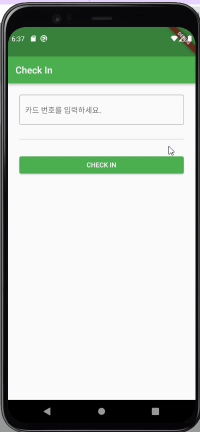

# Exercise 00 - Check In

| 제출할 폴더 : | ex00                                                         |
| :------------ | :----------------------------------------------------------- |
| 제출할 파일 : | `ex00/main.dart`, `ex00/custom_widget/first_page.dart`<br />, `ex00/custom_widget/second_page.dart` |
| 참고사항 :    | 없음                                                         |

- 이 과제의 목표는 App에서 사용자에 대한 입력을 이해하고 값을 처리해 보는 경험을 해보는 것입니다.

- 프로젝트의 이름은 `check_in`이어야 합니다.

- null safety와 lints 적용하지 않으려면 pubspec.yaml의 속성은 다음과 같이 수정을 해야 합니다.

  ```yaml
  environment:
    sdk: ">=2.7.0 <3.0.0"
  
  dev_dependencies:
    flutter_test:
  	#flutter_lints: ^1.0.0
  ```

- Correction

  ```dart
  //그리고 기본적으로 제공되는 코드의 일부분은 다음과 같이 변경되어야 합니다.
  MyApp({Key? key}); -> MyApp({Key key});
  MyHomePage({required this.title}) -> MyHomePage({@required this.title})
  ```

---

- 다음은 Flutter App이 AVD(혹은 Simulator)에서 어떻게 작동해야 하는지를 보여줍니다.

  


  - 사용자의 입력을 받을 수 있는 기능을 갖추어야 합니다.
- 사용자의 입력이 없거나 유효하지 않은 공백인 경우 추가 정보를 표시해야 합니다.
- 사용자의 입력은 숫자를 유도해내야 합니다, 그러므로 키보드는 숫자를 표시해야 합니다.
- 버튼을 누르는 경우 입력창 Form은 App화면에서 사라져야 합니다.
- 사용자의 정보가 입력되고 버튼을 누를 때 일시적인 메시지를 표시합니다.
     - 입력된 값이 정수 값 42라면 CHECK IN에 성공하는 메시지를 그 외에는 실패 메시지를 표시합니다.
- 메모리 또는 리소스의 누수는 허용하지 않습니다. 비록 티가 나지 않는다고 해도 말이죠!


⚡️Keyword

`key`, `validate`, `validator`, `FocusScope`, `TextEditingController`, `dispose`
