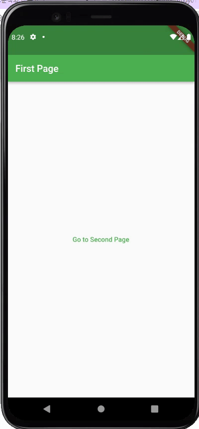

# Exercise 01 - Navigator

| 제출할 폴더 : | ex01      |
| :------------ | :-------- |
| 제출할 파일 : | main.dart |
| 참고사항 :    | 없음      |

- 이 과제의 목표는 Flutter에서 Route 개념을 이해하고 Route를 이동할 수 있도록 구현해보는 것입니다.

- 프로젝트의 이름은 `navigator`이여야 합니다.

- null safety와 lints 적용하지 않으려면 pubspec.yaml의 속성은 다음과 같이 수정하여야 합니다.

  ```yaml
  environment:
    sdk: ">=2.7.0 <3.0.0"
  
  dev_dependencies:
    flutter_test:
  	#flutter_lints: ^1.0.0
  ```

- Correction

  ```dart
  //그리고 기본적으로 제공되는 코드의 일부분은 다음과 같이 변경되어야 합니다.
  MyApp({Key? key}); -> MyApp({Key key});
  MyHomePage({required this.title}) -> MyHomePage({@required this.title})
  ```

---

- 다음은 Flutter App이 AVD(혹은 Simulator)에서 어떻게 작동해야 하는지를 보여줍니다.

  


  - 각각의 Scaffold가 AppBar를 호출하는 메서드의 이름은 `_buildAppBar`여야 합니다.

    - _buildAppBar 메서드는 PreferredSizeWidget을 반환해야 합니다.

  - 각각의 Scaffold가 body를 호출하는 메서드의 이름은 `_buildBody`여야 합니다.

     - _buildBody 메서드는 Widget을 반환해야 합니다.

- App의 전체적인 분위기는 반드시 같아야 합니다.

     - iOS에서는 Android와는 달리 Route를 이동할 때 Default Action은 Side Motion입니다, 그러니 반드시 위와 같을 필요는 없습니다.


⚡️Keyword

`stack`, `navigator`

