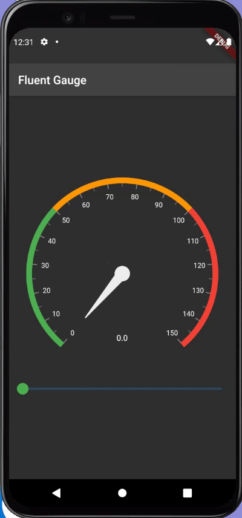

# Exercise 02 - Fluent Library

| 제출할 폴더 : | ex02      |
| :------------ | :-------- |
| 제출할 파일 : | main.dart |
| 참고사항 :    | 없음      |

- 이 과제의 목표는 외부 라이브러리를 사용하여 이미 제공되어 있는 풍부한 UI를 사용해보고 라이브러리의 편리함과 이를 통해 App을 더욱 멋지게 꾸미는 것입니다.

- 프로젝트의 이름은 `fluent_gauges`여야 합니다.

- null safety와 lints 적용하지 않으려면 pubspec.yaml의 속성은 다음과 같이 수정을 해야 합니다.

  ```yaml
  environment:
    sdk: ">=2.7.0 <3.0.0"
  
  dev_dependencies:
    flutter_test:
  	#flutter_lints: ^1.0.0
  ```

- Correction

  ```dart
  //그리고 기본적으로 제공되는 코드의 일부분은 다음과 같이 변경되어야 합니다.
  MyApp({Key? key}); -> MyApp({Key key});
  MyHomePage({required this.title}) -> MyHomePage({@required this.title})
  ```

---

- 다음은 Flutter App이 AVD(혹은 Simulator)에서 어떻게 작동해야 하는지를 보여줍니다.

  


  - 라이브러리는 다음과 같이 주어집니다.

    - [syncfusion_flutter_gauges | Flutter Package](https://pub.dev/packages/syncfusion_flutter_gauges)
- 라이브러리는 Flutter SDK의 버전에 맞추어 사용해야 합니다.
- Gauge의 데이터는 표시되어야 하며 사용자의 반응과 연동되어야 합니다.
- App의 전체적인 분위기는 반드시 같아야 합니다.

⚡️Keyword

[pub.dev](<http://pub.dev>), `Slider`

