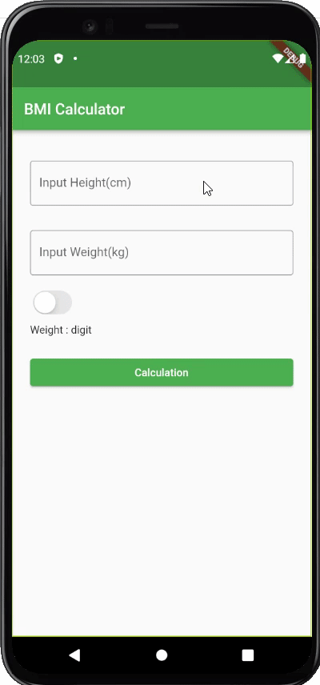

# Exercise 03 - BMI Calculator

| 제출할 폴더 : | ex03                                                         |
| :------------ | :----------------------------------------------------------- |
| 제출할 파일 : | `ex03/main.dart`, `ex03/custom_widget/bmi_input_page.dart`<br />, `ex03/custom_widget/bmi_output_page.dart` |
| 참고사항 :    | 없음                                                         |

- 이 과제의 목표는 Route의 전환 및 외부 라이브러리를 통해 멋진 UI를 구현하고 하나의 기능을 구성하는 App을 만들어 보는 것입니다.

- 프로젝트의 이름은 `bmi_calculator`이여야 합니다.

- null safety와 lints 적용하지 않으려면 pubspec.yaml의 속성은 다음과 같이 수정하여야 합니다.

  ```yaml
  environment:
    sdk: ">=2.7.0 <3.0.0"
  
  dev_dependencies:
    flutter_test:
  	#flutter_lints: ^1.0.0
  ```

- Correction

  ```dart
  //그리고 기본적으로 제공되는 코드의 일부분은 다음과 같이 변경되어야 합니다.
  MyApp({Key? key}); -> MyApp({Key key});
  MyHomePage({required this.title}) -> MyHomePage({@required this.title})
  ```

---

- 다음은 Flutter App이 AVD(혹은 Simulator)에서 어떻게 작동해야 하는지를 보여줍니다.

  


  - 라이브러리는 다음과 같이 주어집니다.

    - [syncfusion_flutter_gauges | Flutter Package](https://pub.dev/packages/syncfusion_flutter_gauges)
- 사용자의 입력을 받을 수 있는 기능을 갖추어야 합니다.
- 사용자의 입력이 없거나 유효하지 않은 공백인 경우 추가 정보 및 일시적인 메시지를 표시해야 합니다.
- 사용자의 입력은 숫자를 유도해내야 합니다, 그러므로 키보드는 숫자를 표시해야 합니다.
- 계산 버튼을 누르는 경우 입력창 Form은 App화면에서 사라지고 결과 창으로 전환되어야 합니다.
- 스위치 버튼을 활성화 하는 경우 몸무게 데이터는 모호하게 표시됩니다.
- 메모리 또는 리소스의 누수는 허용하지 않습니다. 비록 티가 나지 않는다고 해도 말이죠!
- 결과 창에서 표시되는 데이터는 적절한 Collection으로 관리되어야 합니다.

⚡️Keyword
`BMI`