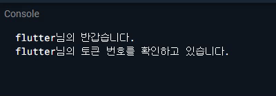

# Exercise 01 - Please Be Patient!

| 제출할 폴더 : | ex01      |
| :------------ | :-------- |
| 제출할 파일 : | main.dart |
| 참고사항 :    | 없음      |

- 이 과제의 목표는 네트워크 통신 또는 파일IO를 효율적으로 처리할 수 있는 비동기 처리를 이해하고 처리하는 경험을 해보는 것입니다.

- 이 프로젝트는 DartPad를 추천합니다, 물론 Flutter에서 test를 통해 해결할 수 있습니다.

- null safety와 lints 적용하지 않으려면 pubspec.yaml의 속성은 다음과 같이 수정을 해야 합니다.

  ```yaml
  environment:
    sdk: ">=2.7.0 <3.0.0"
  
  dev_dependencies:
    flutter_test:
  	#flutter_lints: ^1.0.0
  ```

- Correction

  ```dart
  //그리고 기본적으로 제공되는 코드의 일부분은 다음과 같이 변경되어야 합니다.
  MyApp({Key? key}); -> MyApp({Key key});
  MyHomePage({required this.title}) -> MyHomePage({@required this.title})
  ```

---

- 제공된 main.dart를 수정하세요

- 다음은 여러분이 수정한 main.dart가 Dart Pad 혹은 로컬 환경에서 어떻게 작동해야 하는지를 보여줍니다.

  


  - 데이터의 값(tokenList)은 임의로 변경해서는 안됩니다.
- 메서드의 반환형과 기능을 변경할 수 있습니다.

⚡️Keyword
`asynchronous`, `synchronous`, `Future`

