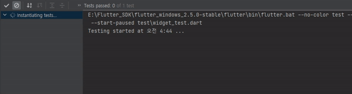

# Exercise 02 - Status Code 200

| 제출할 폴더 : | ex02             |
| :------------ | :--------------- |
| 제출할 파일 : | widget_test.dart |
| 참고사항 :    | 없음             |

- 이 과제의 목표는 Flutter에서 Network의 대표 프로토콜 중 하나인 http를 이해하고 효율적인 코드 작성을 위한 test code를 작성하고 활용하여 네트워크를 통해 데이터 통신을 체험 해 보는 것입니다.

- 프로젝트의 이름은 `statue_code_200`이어야 합니다.

- null safety와 lints 적용하지 않으려면 pubspec.yaml의 속성은 다음과 같이 수정을 해야 합니다.

  ```yaml
  environment:
    sdk: ">=2.7.0 <3.0.0"
  
  dev_dependencies:
    flutter_test:
  	#flutter_lints: ^1.0.0
  ```

- Correction

  ```dart
  //그리고 기본적으로 제공되는 코드의 일부분은 다음과 같이 변경되어야 합니다.
  MyApp({Key? key}); -> MyApp({Key key});
  MyHomePage({required this.title}) -> MyHomePage({@required this.title})
  ```

---

- 다음은 Flutter App이 Android Studio에서 어떻게 작동해야 하는지를 보여줍니다.

  


  - 라이브러리는 다음과 같이 주어집니다.
    - [http | Dart Package](https://pub.dev/packages/http)
- 라이브러리는 Flutter SDK의 버전에 맞추어 사용해야 합니다.
- 통신을 시도하는 URL은 다음과 같이 주어집니다.
  - [data](https://jsonplaceholder.typicode.com/users)
- 코드는 반드시 test의 widget_test.dart에 작성되고 테스트 되어야 합니다.

⚡️Keyword
`http`, `GET`, `async`, `await`, `statusCode`