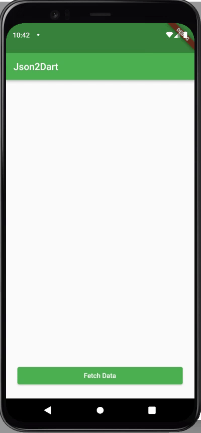

# Exercise 03 - Json to Dart Class

| 제출할 폴더 : | ex03                                           |
| :------------ | :--------------------------------------------- |
| 제출할 파일 : | `ex03/main.dart`, `ex03/model/todo_model.dart` |
| 참고사항 :    | 없음                                           |

- 이 과제의 목표는 네트워크에서 가장 많이 사용되는 데이터 포멧 중 하나인 Json을 활용하여 데이터를 변환하여 효율적으로 사용할 수 있는 방법을 배워보고 활용하는 경험을 해보는 것 입니다.

- 프로젝트의 이름은 `json2dart`이여야 합니다.

- null safety와 lints 적용하지 않으려면 pubspec.yaml의 속성은 다음과 같이 수정하여야 합니다.

  ```yaml
  environment:
    sdk: ">=2.7.0 <3.0.0"
  
  dev_dependencies:
    flutter_test:
  	#flutter_lints: ^1.0.0
  ```

- Correction

  ```dart
  //그리고 기본적으로 제공되는 코드의 일부분은 다음과 같이 변경되어야 합니다.
  MyApp({Key? key}); -> MyApp({Key key});
  MyHomePage({required this.title}) -> MyHomePage({@required this.title})
  ```

---

- 다음은 Flutter App이 AVD(혹은 Simulator)에서 어떻게 작동해야 하는지를 보여줍니다.

  


  - 라이브러리는 다음과 같이 주어집니다
    - [http | Dart Package](https://pub.dev/packages/http)
- 라이브러리는 Flutter SDK의 버전에 맞추어 사용해야 합니다.
- 통신을 시도하는 URL은 다음과 같이 주어집니다.
  - [data](https://jsonplaceholder.typicode.com/todos/1)
- class `TodoModel`을직접 정의해야 합니다. 네, 말 그대로 직접 정의하세요 그리고 이후에 플러그인을 통한 편리함을 느껴보세요. `TodoModel`는 http통신의 데이터 결과 값을 관리해야 합니다.
  - TodoModel은 fromJson이라는 Constructor를 통해 데이터 값이 초기화 되어야 합니다.
- 그럴 일은 없겠지만 혹시라도 네트워크 통신 Code가 200이 아닌경우 Exception처리를 해야 합니다.
- 버튼을 눌렀을 때 호출하는 메서드의 이름은 `_fetchData`여야 합니다.
  - _fetchData 함수는 TodoModel을 반환해야 합니다.
- App의 전체적인 분위기는 반드시 같아야 합니다.

⚡️Keyword
`json to dart`, `jsonDecode`, `Exception`, `ListView`, `named constructor`, `collection if`, `Card`