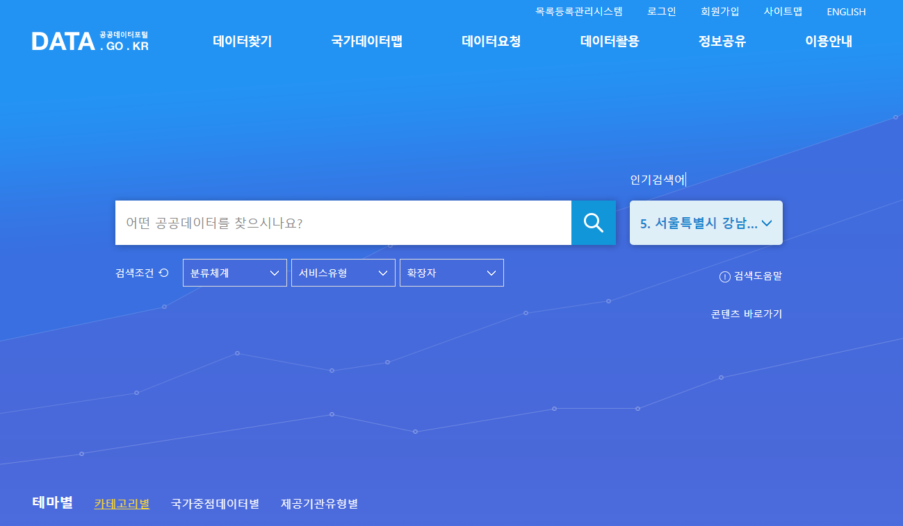

# Contents

# **Preamble**

  

- Flutter Piscine을 진행하면서 다양한 위젯을 다루는 방법과 비동기를 통한 네트워크 통신에 대해 알아보았습니다.

- 외부 API를 통해 필요한 값을 처리하여 App에 처리하기까지 기본적인 내용을 다루었고 더 자세한 내용은 Flutter Piscine의 심화 단계에서 경험하실 수 있을 것입니다.

- 필요한 데이터는 대부분 외부 Api를 통해서 얻을 수 있으며 데이터는 회사, 정부, 각 기관을 통해 적절한 절차 후 받아 사용할 수 있습니다. 기발한 아이디어를 통해서 필요한 자료를 찾아 나만의 App으로 표현 해 보세요!

  [Kakao Developers](https://developers.kakao.com/)

  [공공데이터 포털](https://www.data.go.kr/)

------

# **Instructions**

노골적인 모순이 없는 이상, 해당 지침은 Dart-Flutter Piscine의 모든 과제에 적용됩니다.  
- 이 페이지에 있는 내용만이 레퍼런스로 적용됩니다. 루머를 믿지 마세요!
- 파일 제출 전에 이 문서가 변경될 수도 있으니 주의하세요!
- 플러터는 쉽고 빠르게 개발하고 아름다운 결과를 추구합니다, 명시적이지 않은 부분은 아름다움으로 채우세요.
- 이번 과제들은 난이도별로 배치되어 있습니다 - 쉬운 것부터 어려운 것 까지요. 만약 쉬운 과제가 제대로 작동하지 않으면, `우리는 절대` 어려운 과제를 (완벽하게 구현하였더라도) 채점하지 않을 것입니다.
- 각 과제별로 제출 필수사항을 지키셔야 합니다.
- 여러분의 과제는 같은 피씨너들에게 채점받고 점수가 매겨질 것입니다.
- Dart과제들은 DartPad([https://dartpad.dev](https://dartpad.dev/))를 통해서도 해결할 수 있습니다.
- Flutter에서 필요한 부분들은 Dart에서도 찾을 수 있을거에요. 그러니 Dart를 우습게 넘기지 마세요!
- 질문 있으세요? 오른쪽 동료에게 물어보세요. 아니면 왼쪽 동료한테 물어보세요.
- 여러분이 참고할 만한 가이드는 `Google / man / internet / stackoverflow` 등이 있습니다.
- 인트라나 슬랙의 피씬 채널에서 토의하는 것을 잊지 마세요!
- 예시를 꼼꼼히 살펴보세요. 과제에 명시되지 않은 상세한 부분들이 들어있을 수도 있으니까요.
- 오딘의 힘으로, 토르의 힘으로! 열심히 고민해 보세요!!!
