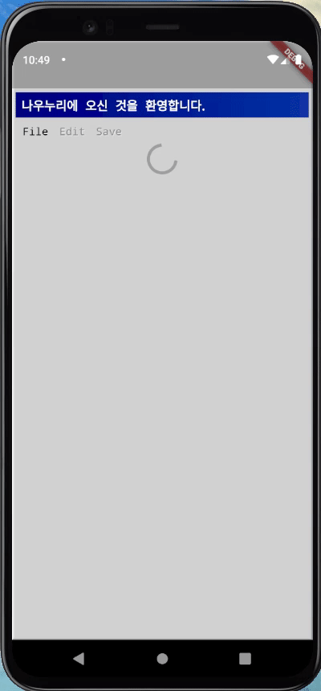

# Exercise 00 - Back to the 1995

| 제출할 폴더 : | ex04                                                         |
| :------------ | :----------------------------------------------------------- |
| 제출할 파일 : | `ex00/main.dart`, `ex00/models/(필요한 모든 모델).dart`<br />`ex00/custom_widget/(필요한 모든 위젯).dart` |
| 참고사항 :    | 없음                                                         |

- 이 과제의 목표는 외부 API를 활용하여 *Retro* style의 인터넷 게시판 기능을 제공하는 App을 만들어 보는 것 입니다.

- 프로젝트의 이름은 `dot_com_board`여야 합니다.

- null safety와 lints 적용하지 않으려면 pubspec.yaml의 속성은 다음과 같이 수정을 해야 합니다.

  ```yaml
  environment:
    sdk: ">=2.7.0 <3.0.0"
  
  dev_dependencies:
    flutter_test:
  	#flutter_lints: ^1.0.0
  ```

- Correction

  ```dart
  //그리고 기본적으로 제공되는 코드의 일부분은 다음과 같이 변경되어야 합니다.
  MyApp({Key? key}); -> MyApp({Key key});
  MyHomePage({required this.title}) -> MyHomePage({@required this.title})
  ```

---

- 다음은 Flutter App이 AVD(혹은 Simulator)에서 어떻게 작동해야 하는지를 보여줍니다.

  


  - 라이브러리는 다음과 같이 주어집니다
    - [http | Dart Package](https://pub.dev/packages/http)
    - https://pub.dev/packages/flutter95
- 라이브러리는 Flutter SDK의 버전에 맞추어 사용해야 합니다.
- 통신을 시도하는 URL은 다음과 같이 주어집니다.
  - [data1](https://jsonplaceholder.typicode.com/posts)
  - [data2](https://jsonplaceholder.typicode.com/comments)
- App 초기화면에서 네트워크 지연이 발생하는 경우 로딩을 반드시 표시해야 합니다.
- 각 통신에 맞는 class model을 정의해야 합니다.
  - 각각의 class model은 http통신의 데이터 결과 값을 관리해야 합니다.
  - 각각의 class model은 fromJson이라는 Constructor를 통해 데이터 값이 초기화 되어야 합니다.
- 네트워크 통신 Code가 200이 아닌경우 Exception처리를 해야 합니다.
- 사용하지 않을 데이터를 모두 요청하는 것은 효율적이지 못한 행동입니다. 필요한 데이터를 적절하게 질의하세요.
- App의 전체적인 분위기는 반드시 같아야 합니다.

⚡️Keyword
`query`, `1995`