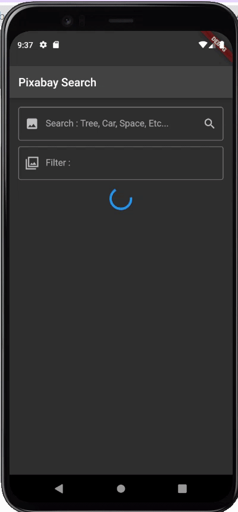

# Exercise 01 - Beauty Images

| 제출할 폴더 : | ex01                                                         |
| :------------ | :----------------------------------------------------------- |
| 제출할 파일 : | `ex01/main.dart`, `ex01/models/(필요한 모든 모델).dart`<br />`ex01/custom_widget/(필요한 모든 위젯).dart` |
| 참고사항 :    | 없음                                                         |

- 이 과제의 목표는 외부 API를 활용하여 영감을 주는 이미지 검색 App을 만들어 보는 것 입니다.

- 프로젝트의 이름은 `pixabay_search`이여야 합니다.

- null safety와 lints 적용하지 않으려면 pubspec.yaml의 속성은 다음과 같이 수정하여야 합니다.

  ```yaml
  environment:
    sdk: ">=2.7.0 <3.0.0"
  
  dev_dependencies:
    flutter_test:
  	#flutter_lints: ^1.0.0
  ```

- Correction

  ```dart
  //그리고 기본적으로 제공되는 코드의 일부분은 다음과 같이 변경되어야 합니다.
  MyApp({Key? key}); -> MyApp({Key key});
  MyHomePage({required this.title}) -> MyHomePage({@required this.title})
  ```

---

- 다음은 Flutter App이 AVD(혹은 Simulator)에서 어떻게 작동해야 하는지를 보여줍니다.

  


  - 라이브러리는 다음과 같이 주어집니다
    - [http | Dart Package](https://pub.dev/packages/http)
    
- 라이브러리는 Flutter SDK의 버전에 맞추어 사용해야 합니다.

- 통신을 시도하는 URL은 다음과 같이 주어집니다.
  - [data](https://pixabay.com/service/about/api/)
  
- 다음의 예와 같이 API키를 발급받아야 합니다.

    

	>❗️API Key는 엄격하게 관리되어야 합니다. 버전관리 도구를 사용하는 경우 .ignore처리를 해야 합니다.

- App 초기화면에서 네트워크 지연이 발생하는 경우 로딩을 반드시 표시해야 합니다.

- class `PixabayDataModel`을 정의해야 합니다.

  - `PixabayDataModel`은 http통신의 데이터 결과 값을 관리해야 합니다.
  - `PixabayDataModel`은 fromJson이라는 Constructor를 통해 데이터 값이 초기화 되어야 합니다.

- 네트워크 통신 Code가 200이 아닌경우 Exception처리를 해야 합니다.

- 메모리 또는 리소스의 누수는 허용하지 않습니다. 비록 티가 나지 않는다고 해도 말이죠!

- 사용자의 입력을 처리할 수 있는 Widget은 각각 다음의 기능을 갖추어야 합니다.

  - 이미지를 검색할 수 있는 기능
  - 주어진 이미지를 기준으로 사용자의 입력 값 기준으로 필터링 처리가 되어야 합니다.

- 사용자의 입력이 없거나 유효하지 않은 공백인 경우 추가 정보와 일시적인 메시지를 표시해야 합니다.

- 버튼을 누르는 경우 입력창 Form은 App화면에서 사라지고 네트워크 통신으로 데이터를 요청해야 합니다.

- 초기 이미지를 요청하는 키워드는 마음대로 정해도 됩니다.

- 이미지 자체에 스크롤 기능이 들어가서는 안됩니다.

- App의 전체적인 분위기는 반드시 같아야 합니다.

⚡️Keyword
`Rx Programming`, `API Protocol`