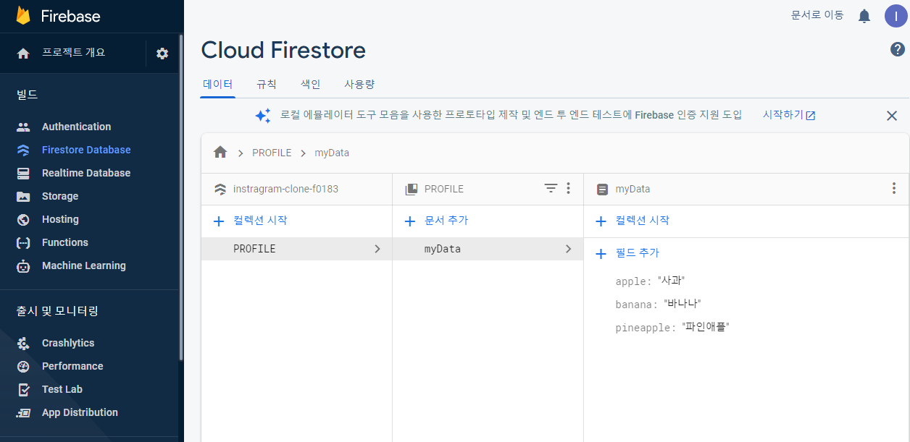

# Exercise 02 - My Database

| 제출할 폴더 : | ex02                                                         |
| :------------ | :----------------------------------------------------------- |
| 제출할 파일 : | `ex02/main.dart`, `ex02/models/(필요한 모든 모델).dart`<br />`ex02/custom_widget/(필요한 모든 위젯).dart` |
| 참고사항 :    | 없음                                                         |

- 이 과제의 목표는 Firebase의 Firestore database를 활용하여 BaaS를 간단하게 사용해보고 경험해 보는 것입니다.

- 프로젝트의 이름은 'my_database'여야 합니다.

- null safety와 lints 적용하지 않으려면 pubspec.yaml의 속성은 다음과 같이 수정을 해야 합니다.

  ```yaml
  environment:
    sdk: ">=2.7.0 <3.0.0"
  
  dev_dependencies:
    flutter_test:
  	#flutter_lints: ^1.0.0
  ```

- Correction

  ```dart
  //그리고 기본적으로 제공되는 코드의 일부분은 다음과 같이 변경되어야 합니다.
  MyApp({Key? key}); -> MyApp({Key key});
  MyHomePage({required this.title}) -> MyHomePage({@required this.title})
  ```

---

- 다음은 Firebase의 Database에서 어떻게 작동해야 하는지를 보여줍니다.

  


  - BaaS는 다음과 같이 주어집니다.
    - [Firebase](https://firebase.google.com/)

- 라이브러리는 다음과 같이 주어집니다.

  - [cloud_firestore | Flutter Package](https://pub.dev/packages/cloud_firestore)

  - [firebase_core | Flutter Package](https://pub.dev/packages/firebase_core)

- 라이브러리는 Flutter SDK의 버전에 맞추어 사용해야 합니다.

- Android 또는 IOS에 Firebase가 추가되어야 합니다.

- Firebase의 프로젝트의 이름은 'myfirebase'이여야 합니다.

- Package등록은 mydate_base의 고유한 값이여야 합니다.

- 선택사항은 말 그대로 선택사항입니다. (하지만 디버그 서명에 대해서는 알아보는 것이 좋을거예요.)

- Cloud Firestore의 위치는 초기 설정 후 변경할 수 없습니다. 지역을 잘 생각해서 고려하세요!

- 여러분들의 데이터는 다음과 같은 형식으로 저장되어야 합니다.

  - collection : PROFILE, doc : MyData

- 저장한 값을 불러오기도 가능해야 합니다.

- App의 형식은 상관없습니다. 여러분들의 Data를 Firestore에 저장하고 불러오세요.

⚡️Keyword
`BaaS`, `SHA-1`, `build.gradle`,`google-services.json`,`CRUD`